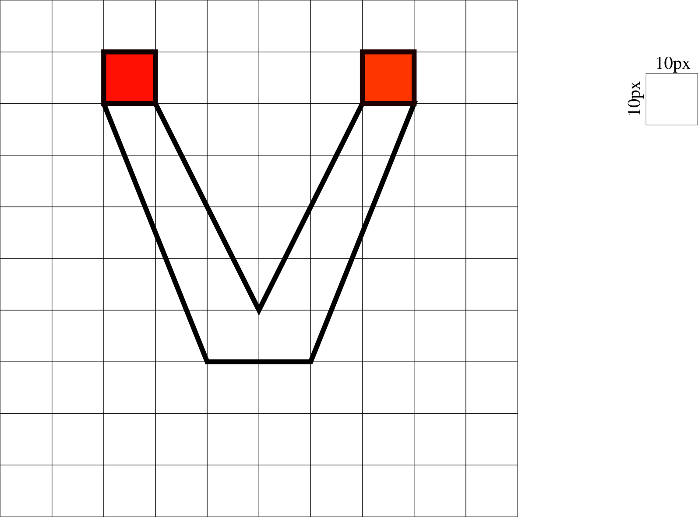

# Examen Visualdon - 28 juin 2023

Le travail sera rendu au plus tard à 16h15, par e-mail (noemi.romano@heig-vd.ch).

Vous rendrez un fichier ZIP de tout votre projet excepté le dossier "node_modules" et vous donnerez votre nom de famille, prénom et classe à ce dossier. Vous êtes responsable de son contenu et devez vous assurer de la bonne réception du dossier avant de quitter la salle.

## Installation
* Clonez la [repository](https://github.com/romanoe/examen-visualdon-23/) `git clone https://github.com/romanoe/examen-visualdon-23.git`
* Rentrez dans le dossier *examen-visualdon-23* :  ``cd examen-visualdon-23``
* Installez les packages nécessaires : ```npm install```
* Démarrez le serveur : ```npm run dev```

:rocket: Vous devriez avoir accès à votre serveur local sur [localhost:5173](http:localhost:5173) :rocket:

## Exercice 1 - SVG (15 points)
Reproduire le dessin suivant dans le navigateur à l’aide des outils que vous avez appris en cours.

> :exclamation: La grille est à titre indicatif et elle ne doit pas être dessinée.



## Exercice 2 - Votations cantonales 18 juin 2023 (20 points)
Vous avez à disposition les données des résultats de votations sur la loi du Protection du climat du 18 juin 2023 (data/votations_vd.geojson).

S'agissant d'un fichier `geojson`, la composante géographique est directement dans les données. Les données sont structurées de la manière suivante :

* `id` : identifiant commune
* `name`: nom de la commune (p. ex. _Lausanne_)
* `oui` : nombre de oui
* `non`: nombre de non

Apportez les manipulations suivantes et imprimez les résultats dans la console :

1. Le **pourcentage de oui** pour chacune des communes :dart: **5 points** :dart:
2. La **commune** avec le **pourcentage de non** le plus elevé :dart: **5 points** :dart:
3. Le résultat de la votation sur l'ensemble du canton (moyenne **pourcentage de oui**, moyenne **pourcentage de non**) :dart: **10 points** :dart:

## Exercice 3 - Visualisations (45 points)
Avec les donnés de l'exercice précédent, produisez les visualisations suivantes :

### 3.1 Carte


* Visualisez une carte choroplète des communes selon le **pourcentage oui** :dart: **10 points** :dart:

> :exclamation: Veuillez utiliser la _projection_ et le _path_ déjà en place dans le code si vous utilisez *d3*. Autrement, vous êtes libres d'utiliser n'importe quelle librairie de cartographie web !

> :bulb: La fonction `rewind` est nécessaire pour dessiner les éléments _path_ dans le bon ordre comme dans l'exemple https://codepen.io/romanoe/pen/mdGZgBx. Veuillez utiliser les données `reversed_data` pour la création de la carte


* Rajoutez une info-bulle quand vous survolez sur les communes avec les informations suivante : **nom de la commune** et **pourcentage de oui** :dart: **10 points** :dart:
* Quel est votre avis par rapport à ce genre de visualisation ? Il y a t'il des biais ? Quel type de réprésentation serait la plus adaptée ? Imprimez la réponse dans la console. :dart: **5 points** :dart:


### 3.2 Barchart

* Créez un diagramme en bâton (barchart) en ayant en axe X les _noms des communes_ et en axe Y le _pourcentage de oui_ :dart: **10 points** :dart:
> :bulb: Exemple: https://codepen.io/romanoe/pen/oNPGzyY 
* Ordonnez les bâtons dans l'ordre croissant :dart: **5 points** :dart:
* Créez une animation d'entrée pour les bâtons (height=0 à height=**pourcentage de oui**`)  :dart: **5 points** :dart:

## Exercice 4 - Web scraping (20 points)
* Rentrez dans le dossier web-scraping `cd webscraping`
* Installez les packages nécessaires `npm install`
* Vous pouvez tester votre code avec les commandes `node src/index.js`. Les résultats devront être imprimés directement dans le terminal.

À l’aide des outils de web-scraping que vous avez appris en cours, allez à la page Wikipedia listant les cours d'eau en Suisse (https://fr.wikipedia.org/wiki/Liste_des_cours_d%27eau_de_la_Suisse) et :

1. Prenez une capture d’écran de la page :dart: **5 points** :dart:
2. Imprimez dans la console tous les noms des cours d'eau de plus de 30 km :dart: **5 points** :dart:
3. Imprimez dans la console le cours d'eau le plus long :dart: **5 points** :dart:
4. Imprimez dans la console le cours d'eau avec le débit le plus élevé :dart: **5 points** :dart:

